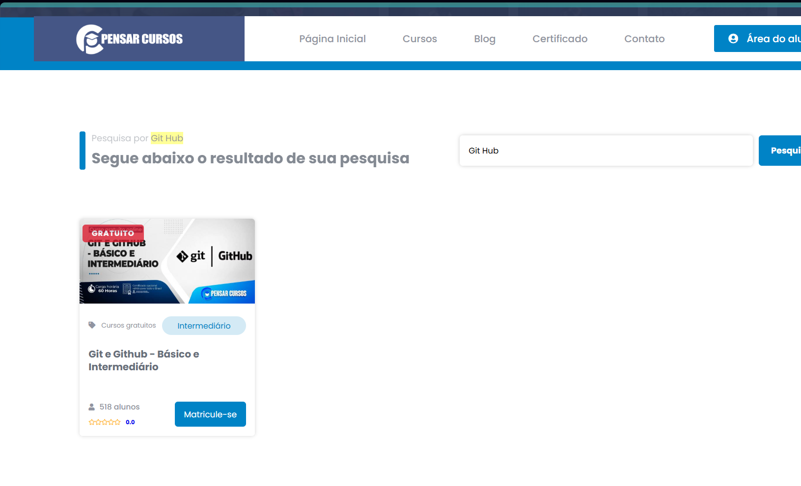

# 📅 July 23, 2026

## Topics

- What is Git
- What is GitHub
- Why version control matters

## Reflection

Today I learned that GitHub is much more than a place to store code. It is a platform that allows developers to organize projects, collaborate with others, and keep track of every change made during development.

## Next Goal

Learn how commits work.

## 📸 Course Screenshot

